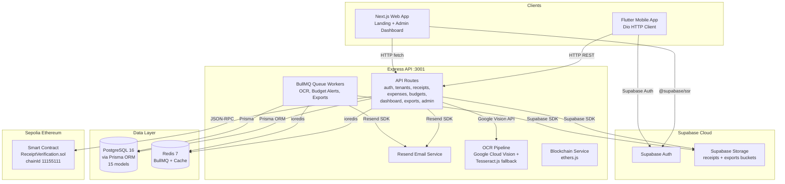

# JagaFinance

> **B2B Receipt & Expense Intelligence Platform** — Digitize physical receipts into auditable financial reports in seconds.

Multi-tenant receipt and expense management platform with AI-powered OCR, real-time budget monitoring, and export-ready financial reporting built for Indonesian B2B workflows with PPN/PPh compliance.

---

## Architecture



---

## Stack

| Layer | Technology | Purpose |
|---|---|---|
| **Runtime** | Node.js 20+, pnpm 9 | Package management, monorepo orchestration |
| **Web** | Next.js 14 (App Router) | SSR, PWA, landing page, admin dashboard |
| **Mobile** | Flutter + Provider + Dio | Native Android app, camera/gallery upload |
| **API** | Express 4 | RESTful endpoints, file upload, auth |
| **Language** | TypeScript 5.5 | Strict typing across 100% of codebase |
| **ORM** | Prisma 5 | Type-safe DB access, migrations |
| **Database** | PostgreSQL 16 | Multi-tenant with RLS |
| **Cache & Queues** | Redis 7 + BullMQ | OCR jobs, budget alerts, exports |
| **Auth** | Supabase Auth + JWT | SSR session + Bearer token |
| **OCR** | Tesseract.js + Google Cloud Vision | Local + Cloud OCR pipeline |
| **Email** | Resend | Transactional notifications |
| **Blockchain** | Hardhat + Solidity | Receipt hash verification on Sepolia |
| **Styling** | Tailwind CSS + CVA | Utility-first design system |
| **Hosting** | Railway | Production API deployment |

---

## Project Structure

```
jagafinance/
├── apps/
│   ├── web/                    # Next.js 14 (company profile + admin dashboard)
│   └── mobile/                 # Flutter (login, register, dashboard, upload)
├── packages/
│   ├── api/                    # Express 4 REST API (OCR, queues, export, admin)
│   ├── db/                     # Prisma 5 schema + client (PostgreSQL 16)
│   └── blockchain/             # Hardhat + Solidity (Sepolia Ethereum)
├── supabase/
│   └── migrations/             # Database migration scripts
├── docker-compose.yml          # Local Postgres 16 + Redis 7
├── turbo.json                  # Turborepo pipeline config
└── pnpm-workspace.yaml         # Workspace configuration
```

---

## Deployments

| Environment | URL | Status |
|---|---|---|
| **Production API** | `https://jagafinance-production.up.railway.app/api/v1` | Active |
| **Health Check** | `https://jagafinance-production.up.railway.app/api/v1/health` | Passing |

API is auto-deployed via Railway. Every push to `main` triggers a build and redeploy.

---

## Getting Started

### Prerequisites

```bash
node -v          # >= 20
pnpm -v          # 9.x (install: npm install -g pnpm@9)
docker info      # Docker Desktop running
```

### Quick Start (Local Development)

```bash
# 1. Clone and install
git clone https://github.com/RustyRustacle/JagaFinance.git
cd JagaFinance
pnpm install

# 2. Start Postgres + Redis
pnpm docker:up

# 3. Configure environment
cp .env.example .env
cp packages/api/.env.example packages/api/.env
# Edit .env files with your credentials

# 4. Initialize database
pnpm db:generate       # Generate Prisma client
pnpm db:push           # Push schema to PostgreSQL

# 5. Start development
pnpm dev
```

### Mobile App

```bash
cd apps/mobile
flutter run
```

The mobile app points to the production API by default.

---

## API Overview

All endpoints return a standard envelope:

```typescript
// Success
{ "success": true, "data": { ... }, "meta": { "page": 1, "limit": 20, "total": 42, "totalPages": 3 } }

// Error
{ "success": false, "error": { "code": "VALIDATION_ERROR", "message": "...", "details": [...] } }
```

| Route | Auth | Description |
|---|---|---|
| `GET /api/v1/health` | — | Health check |
| `POST /api/v1/auth/register` | — | Register and create tenant |
| `POST /api/v1/auth/login` | — | Login with email/password |
| `GET/POST /api/v1/tenants` | JWT | Tenant management |
| `GET/POST /api/v1/receipts` | JWT | Receipt CRUD and OCR upload |
| `GET/POST /api/v1/expenses` | JWT | Expense CRUD |
| `GET/POST /api/v1/budgets` | JWT+RBAC | Budget management |
| `GET /api/v1/dashboard/overview` | JWT | Aggregated stats |
| `GET/POST /api/v1/exports` | JWT | PDF/Excel export jobs |
| `GET /api/v1/admin/stats` | JWT+Admin | Platform-wide statistics |
| `GET /api/v1/admin/users` | JWT+Admin | All platform users |
| `GET /api/v1/admin/tenants` | JWT+Admin | All platform tenants |

---

## Environment Variables

### Local Development (`.env`)

| Variable | Required | Description |
|---|---|---|
| `DATABASE_URL` | Yes | PostgreSQL connection string |
| `SUPABASE_URL` | Yes | Supabase project URL |
| `SUPABASE_ANON_KEY` | Yes | Supabase anonymous key |
| `SUPABASE_SERVICE_ROLE_KEY` | Yes | Supabase admin key |
| `REDIS_URL` | Yes | Redis connection for BullMQ |
| `JWT_SECRET` | Yes | Token signing secret (min 32 chars) |
| `GOOGLE_APPLICATION_CREDENTIALS` | Optional | GCP service account file path |
| `RESEND_API_KEY` | Optional | Email delivery |

### Railway (Production)

`DATABASE_URL` and `REDIS_URL` are set automatically by Railway PostgreSQL and Redis plugins. Remaining variables are configured via the Railway dashboard.

---

## Commands

| Command | Description |
|---|---|
| `pnpm dev` | Start all dev servers (API :3001 + Web :3000) |
| `pnpm build` | Production build all packages |
| `pnpm test` | Run vitest test suites |
| `pnpm db:generate` | Regenerate Prisma client |
| `pnpm db:push` | Push Prisma schema to database |
| `pnpm docker:up` | Start Postgres + Redis |
| `pnpm docker:down` | Stop containers |

---

## Key Features

- **AI-Powered OCR** — Dual pipeline: Tesseract.js (local, free) + Google Cloud Vision (cloud, accurate)
- **Multi-Tenant RBAC** — Isolated tenant data with role-based access control
- **Real-Time Budget Monitoring** — Configurable periods with alert thresholds
- **Tax-Compliant Reporting** — PPN/PPh categorization, PDF/Excel exports
- **Audit Trail** — All mutations logged with actor, action, entity, changes
- **Blockchain Verification** — Optional receipt hash anchoring on Sepolia

---

## Data Flow

| From | To | Protocol | Purpose |
|---|---|---|---|
| Mobile App | Express API | HTTP REST (Dio) | Auth, receipt upload, CRUD operations |
| Web App | Express API | HTTP REST (fetch) | Admin dashboard data |
| Web App | Supabase Auth | Supabase SSR | Auth session (middleware guard) |
| Express API | PostgreSQL | Prisma ORM | All data persistence |
| Express API | Redis | BullMQ / ioredis | Background queues |
| Express API | Supabase Storage | Supabase JS SDK | File upload and download |
| Express API | Google Vision | gRPC / REST SDK | OCR text extraction |
| Express API | Resend | HTTP SDK | Email notifications |
| Express API | Sepolia Contract | ethers.js (JSON-RPC) | Receipt hash on-chain verification |

---

<div align="center">
  <sub>Built with TypeScript, Next.js, Express, Prisma, Flutter</sub>
</div>
